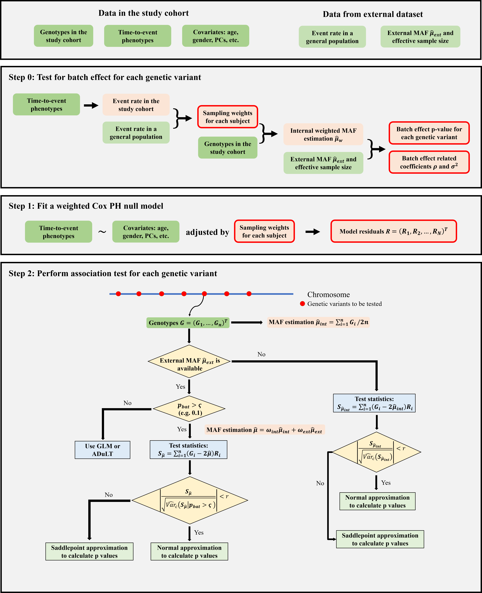

# WtCoxG

WtCoxG is an accurate, powerful, and computationally efficient Cox-based approach for performing genome-wide time-to-event data analyses in study cohorts with case ascertainment.

## Table of Contents

* [Introduction to WtCoxG](#introduction-to-wtcoxg)
* [Step-by-step Workflow](#step-by-step-workflow)
   1. [Setting up Input](#1-setting-up-input)
   2. [Fitting Weighted Null Model and Testing for Batch Effect](#2-fitting-weighted-null-model-and-testing-for-batch-effect)
   3. [Association Testing](#3-association-tests)

## Introduction to WtCoxG

**WtCoxG is a Cox regression-based method designed for time-to-event GWAS that accounts for case ascertainment and gains power by utilizing external allele frequencies (AFs) from publicly available datasets.** WtCoxG consists of three main steps:

* **Step 0: (Test for batch effect)** If external allele frequencies are available, we first test for batch effect between internal and external allele frequencies and calculate a batch effect p-value for each genetic variant. Parameters of batch effect are estimated according to the genome-wide batch effect p-values.
* **Step 1: (Fit weighted null model)** In the context of case ascertainment, we fit an Inverse Probability Weighting (IPW) Cox PH null model, in which subjects are assigned different sampling weights. The sampling weight can be calculated according to disease prevalence in the population. The covariates include but are not limited to age, gender, and principal components (PCs).
* **Step 2: (Association testing)** We calculate score statistics for each genetic variant. To further boost statistical power, we incorporate external allele frequencies with batch effect p-value > 0.1 into the score statistics. Then we approximate the distribution of the score statistics using Saddlepoint approximation.



### We Support Using GRM to Adjust for Sample Relatedness

To account for sample relatedness, we follow the strategy of GATE (Dey et al., 2022, Nature Communications), which calculates the ratio of the variance of the score statistic with and without GRM. Therefore, when performing the genome-wide scan in Step 2, the score statistic is calibrated using the variance ratio.

## Step-by-step Workflow

In the following examples, we demonstrate how to test for batch effect and perform association tests, step by step.

### 1) Setting up Input

* **Phenotype File**
  A phenotype file must contain at least three columns: sample ID, an indicator of whether the event occurred (0 or 1), and the time of event occurrence. In this example, we have two covariates: age and sex.

```r
PhenoFile = system.file("extdata", "simuPHENO.txt", package = "GRAB")
PhenoData = data.table::fread(PhenoFile)
PhenoData[, c("IID", "AGE", "GENDER", "SurvTime", "SurvEvent")]
```

* **Genotype File**
  GRAB supports PLINK (.bed) and BGEN (.bgen) formats. We use PLINK files in this example.

```r
GenoFile = system.file("extdata", "simuPLINK.bed", package = "GRAB")
```
  
* **External allele frequency File**
  An external allele frequency file must include at least 7 columns: `CHROM`, `POS`, `ID`, `REF`, `ALT`, `AF_ref`, `AN_ref`, where column `AF_ref` is `ALT` allele frequency and column `AN_ref` is total allele count.

```r
RefAfFile = system.file("extdata", "simuRefAf.txt", package = "GRAB")
data.table::fread(RefAfFile)
```

* **Reference Prevalence**
  The population disease prevalence, which is available from large-scale biobanks and previous studies. In the example, we suppose the prevalence is 10%.

```r
RefPrevalence = 0.1
```

* **Sparse GRM File**
  If the study cohort includes related samples, the sparse GRM file is needed, which must contain three columns: the first column `ID1`, the second column `ID2`, and the last column `Value` (i.e., two times of kinship coefficient between ID1 and ID2).

```r
SparseGRMFile = system.file("extdata", "SparseGRM.txt", package = "GRAB")
data.table::fread(SparseGRMFile)
```

### 2) Fitting weighted null model and testing for batch effect

First we use the function `GRAB.NullModel` to fit a weighted null Cox PH  model and test for the batch effect between internal and external data.

```r
#step0&1: fit a null model and estimate parameters according to batch effect p values

library(GRAB)
OutputDir = tempdir()
OutputStep1 = file.path(OutputDir, "WtCoxG_step1_out.txt")

obj.WtCoxG = GRAB.NullModel(
  formula = survival::Surv(SurvTime, SurvEvent) ~ AGE + GENDER,
  data = PhenoData,
  subjData = PhenoData$IID,
  method = "WtCoxG",
  traitType = "time-to-event",
  GenoFile = GenoFile,
  SparseGRMFile = SparseGRMFile,
  control = list(AlleleOrder = "ref-first", AllMarkers = T, RefPrevalence = RefPrevalence,
                 SNPnum = 1000), # minimum number of SNPs for to call TestforBatchEffect
  RefAfFile = RefAfFile,
  OutputFile = OutputStep1,
  SampleIDColumn = "IID",
  SurvTimeColumn = "SurvTime",
  IndicatorColumn = "SurvEvent"
)
                                        
# check the batcheffect p-values
resultStep1 = data.table::fread(OutputStep1)
resultStep1[, c("CHROM", "POS", "pvalue_bat")]
```

### 3) Association tests

Next, we perform association tests. Only for variants with a batch effect p > `cutoff` (in this example, `cutoff = 0.1`), tests utilizing external allele frequencies will be performed. In an output file of this step, column `WtCoxG.noext` is p-values without using external allele frequencies; column `WtCoxG.ext` is p-values utilizing external allele frequencies.

```r
#step2: association tests
OutputStep2 = file.path(OutputDir, "WtCoxG_step2_out.txt")
if (file.exists(OutputStep2)) file.remove(OutputStep2)
if (file.exists(paste0(OutputStep2, ".index"))) file.remove(paste0(OutputStep2, ".index"))

GRAB.Marker(
  objNull = obj.WtCoxG,
  GenoFile = GenoFile,
  OutputFile = OutputStep2,
  control = list(AlleleOrder = "ref-first", AllMarkers = T, cutoff = 0.1)
)

# check association p-values
resultStep2 = data.table::fread(OutputStep2)
resultStep2[, c("CHROM", "POS", "WtCoxG.noext", "WtCoxG.ext")]
```

## References

Dey, R., Zhou, W., Kiiskinen, T. et al. (2022) Efficient and accurate frailty model approach for genome-wide survival association analysis in large-scale biobanks. Nat Commun 13, 5437. <https://doi.org/10.1038/s41467-022-32885-x>

## Citation

- WtCoxG: Li, Y., Ma, Y., Xu, H., Sun, Y., Zhu, M., Yue, W., Zhou, W., & Bi, W. (2025). **Applying weighted Cox regression to boost powers for genome-wide association studies of time-to-event phenotypes**. *Nature Computational Science* in press.
